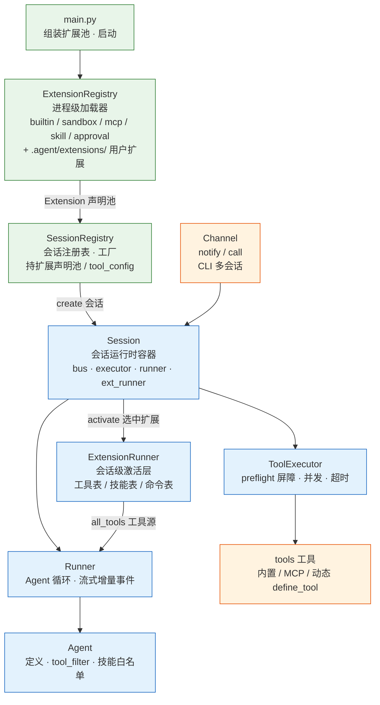
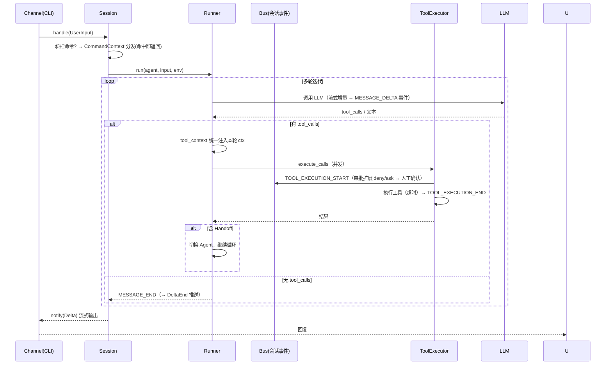

# Walle 🤖

> 一个从零构建的 AI Agent 框架 —— 工具调用 · 多智能体 · MCP · 运行时自扩展 · 全链路可观测

[](https://www.python.org)
[](https://docs.pydantic.dev)
[](https://modelcontextprotocol.io)
[](https://opentelemetry.io)

---

## ✨ 核心特性

| 特性 | 说明 |
|---|---|
| ⚙️ **Agent 循环引擎** | ReAct 式多轮工具调用，流式/非流式双模式，可配置最大轮次 |
| 📝 **Agent 可配置化** | `.agent/agents/*.md` frontmatter 定义（角色/温度/工具筛选/技能白名单），启动按名加载，会话内可切换 |
| 🤝 **多智能体 Handoff** | Agent 可移交任务，支持链式协作 |
| 🔌 **MCP 协议集成** | MCP 作为扩展声明（stdio / Streamable HTTP），连接进程级共享，工具随扩展进会话 |
| 🛡️ **工具治理** | 审批即扩展：conf 规则（allow/deny/ask）由 `Approval` 扩展订阅工具执行事件执行，ASK 经会话通道人工确认；可按工具名 + 参数粒度控制 |
| 🔒 **OS 级沙箱** | 可选 bwrap 沙箱扩展：全盘只读 + 会话 cwd 可写，隐藏凭据路径，可断网；同名覆盖内置 bash，无 bwrap 时自动降级 |
| 🧠 **全链路可观测** | OpenTelemetry Traces + Metrics → Grafana / Tempo / Mimir |
| 💬 **CLI 多会话** | JSON-line 协议多客户端并发会话，流式/非流式回复，连接断开保留状态可重连 |
| 🔌 **插件化扩展** | 会话级扩展激活：工具 / 技能 / 命令 / 事件钩子都是扩展声明；`.agent/extensions/` 目录即插即用，可同名覆盖内置 |
| 🪟 **上下文窗口管理** | 模型主动换窗口（`read`/`edit` 维护 `.agent/note.md` 工作笔记 + `new_window` 硬切）、`history` 工具无损回源、切点 SQLite 持久化 |

---

## 🏗️ 架构

进程级共享"声明"，会话级自持"运行时"。



> 详细类职责与内部变量传递边界见 [docs/architecture.md](docs/architecture.md)。

### 核心流程



执行中 Ctrl+C → 取消当前 run，回到输入提示；空输入（直接回车）/ 空闲 Ctrl+C → 退出（统一出口）

### 分层职责

架构核心原则：**跨层只依赖能力协议（`spec/`），具体实现由装配根注入**，避免具体类型跨层牵扯。依赖方向由 `tests/test_layering.py` 静态校验，违反即 CI 失败。

| 层 | 目录 | 职责 |
|---|---|---|
| 协议面 | `spec/` | **数据模型 + 全部跨层能力协议**（唯一声明面，不提及实现）：protocol/（Channel/Sessions）、messages（Messages/Projection/ProjectionStore）、runtime（ToolTable）、events（EventBus）、llm（LLM）、view（SessionView） |
| 入口·装配根 | `main.py` | 唯一组装进程级具体实现：扩展池（builtin/sandbox/mcp/skill/approval/用户扩展）、进程默认 provider、CLI 服务端 |
| 基建实现 | `infra/` | EventBus、Tool、Provider（LLM 实现）、诊断、日志、遥测、指标、扩展加载/激活器 |
| 核心引擎 | `core/` | 会话装配（SessionRegistry：构造存储/provider 并组装 Session）、Agent 循环（Runner）、工具执行器 |
| 工具/扩展声明 | `tools/` | 内置工具（builtin/）、mcp、skill、approval、sandbox、define_tool —— 均作为扩展声明，依赖协议面 |
| 交互通道 | `channel/` | CLI 多会话服务端（JSON-line 协议），实现 Channel 协议 |
| 消息存储 | `messages/` | InMemory/SQLite/Projected 的 Messages 协议实现 + 装配工厂（build_history） |
| 数据模型 | `spec/schemas/` | 消息、判别联合事件（通知/服务）、Token 用量、后台作业模型 |
| 配置 | `conf/` | Pydantic 配置模型 + YAML 加载 |
| 可观测性 | `observability/` | Docker Compose 编排的监控栈 |

---

## 🚀 快速开始

### 前置条件

- **Python ≥ 3.12**（pyproject.toml 要求）
- **bubblewrap**（可选，启用 OS 级沙箱：`apt install bubblewrap`；缺失时沙箱扩展自动跳过）
- **Docker + Docker Compose**（可选，用于可观测性栈）

### 安装

```bash
git clone <repo-url> walle
cd walle
pip install -e ".[dev]"
```

> 仓库根目录本身即 `walle` 包（`run.sh` 以 `PYTHONPATH=<父目录> -m walle.main` 运行），
> setuptools 的自动发现只扫子目录、找不到根包，故 `pyproject.toml` 里显式声明了
> 包与目录映射。**新增子包时需同步补 `[tool.setuptools]` 的 packages / package-dir 两处。**

### 开发与检查

```bash
pytest -q                      # 单元测试（290 项，无需 API Key）
ruff check .                   # 静态检查
ruff check --fix .             # 自动修复（import 排序等）
```

`tests/test_layering.py` 用 AST 静态校验分层依赖方向（见 `docs/architecture.md`），
违反即失败。CI（`.github/workflows/ci.yml`）在 Python 3.12 / 3.13 上跑上述两项。

### 配置

```bash
cp conf.yaml.example conf.yaml   # 主配置（日志 / 审批）
cp .env.example .env             # LLM API Key
```

### 启动

```bash
./scripts/run.sh                 # 启动 agent + 可观测性（默认）
./scripts/run.sh --no-obs        # 仅启动 agent
./scripts/run.sh --cli           # 服务端 + CLI 客户端（一键对话）
./scripts/run.sh --status        # 服务端状态 + 会话列表
./scripts/run.sh --attach <id>   # 恢复（attach）已有会话
./scripts/run.sh --stop          # 停止常驻 agent 服务端
./scripts/run.sh --obs-only      # 仅启动可观测性容器
./scripts/run.sh --stop-obs      # 停止可观测性
./scripts/run.sh --test          # 运行测试
```

启动后可用 `PYTHONPATH=.. python -m walle.channel.cli` 连接对话（JSON-line 协议多会话；
`PYTHONPATH=..` 使仓库根作为 `walle` 包导入，`run.sh` 内部已处理）。客户端参数：

```bash
PYTHONPATH=.. python -m walle.channel.cli                    # 新建会话（默认全部扩展）
PYTHONPATH=.. python -m walle.channel.cli --attach <id>      # 恢复已有会话
PYTHONPATH=.. python -m walle.channel.cli --list             # 浏览会话（仅元数据）
PYTHONPATH=.. python -m walle.channel.cli --extensions a,b   # 新会话只激活指定扩展
PYTHONPATH=.. python -m walle.channel.cli --dir /path/proj   # 会话工作目录（bash 与沙箱可写区基准）
PYTHONPATH=.. python -m walle.channel.cli --api-key sk-x --base-url https://api.openai.com/v1 --model gpt-4o  # 本会话模型配置
```

`--api-key/--base-url/--model` 三项齐全时，服务端为该会话新建 provider——不同连接可指向不同 OpenAI 兼容端点；缺省回退服务端 `.env` 配置。

会话是**持久实体**（跨连接存活）：连接断开 → `detach` 保留状态（历史），可 `--attach <id>` 重连恢复；连接接入 → `attach` 绑定新传输。真正销毁走服务端停机（`--stop`）。服务端空闲 Ctrl+C 退出。

### 📊 可观测性面板

| 服务 | 地址 | 账号 |
|------|------|------|
| Grafana | http://localhost:3000 | admin / admin |
| Tempo | http://localhost:3200 | - |
| Mimir | http://localhost:9009 | - |

可查看：Agent 每轮迭代耗时与 Span、工具调用次数/耗时/错误率、Handoff 事件。

---

## ⚙️ 配置

### `conf.yaml` — 主配置

```yaml
log:
  level: "DEBUG"
  path: "logs/agent.log"
  backup_count: 30

telemetry:
  enabled: true
  service_name: "agent"
  otlp:
    endpoint: "http://localhost:4317"
    insecure: true
  console_export: false

tool:
  timeout:
    default: 30                       # 全局默认超时（秒）
    overrides:
      ask_user: null                  # None = 豁免超时（等人回答不设时限）
  approval:
    rules:
      - [deny, bash(cmd=rm -rf /)]    # 危险命令直接拒绝
      - [allow, bash(cmd=ls -la *)]   # 安全命令自动放行
      - [allow, ask_user]             # 提问工具自动放行
      - [allow, read]                 # 读文件自动放行（技能按需加载全文）
    default: ask                      # 默认需人工审批

session:
  storage: "sqlite"                   # sqlite | memory
  db_path: "data/session.db"          # sqlite 存储路径（相对项目根）

extension:
  dir: ".agent/extensions"            # 用户扩展目录
  enabled: []                         # 空 = 全部启用；非空 = 白名单
  disabled: []                        # disabled 优先于 enabled

# MCP server 配置不在此文件，统一放在 .agent/mcp.yaml（模型可动态添加）
```

#### 审批规则

规则格式 `[action, pattern]`，pattern 支持 glob：

| action | 含义 |
|---|---|
| `allow` | 放行 |
| `deny` | 拒绝 |
| `ask` | 人工确认（默认） |

示例匹配：`bash`（全部 bash）、`bash(cmd=rm -rf *)`（特定参数）、`ask_user`（工具名）。

工具超时：全局 `tool.timeout.default` 生效，`tool.timeout.overrides` 按工具名覆盖（`None` 豁免超时，如 `ask_user` 等人回答）。

### `.agent/` — 运行时持久化

| 路径 | 内容 | 写入方式 |
|---|---|---|
| `.agent/agents/` | Agent 定义（frontmatter Markdown，文件名即 agent 名） | 手动编辑 |
| `.agent/skills/` | 技能（SKILL.md + 可选 scripts/assets） | `skill-creator` 或手动 |
| `.agent/tools/` | 模型定义的代码工具 | `define_tool` |
| `.agent/extensions/` | 用户扩展（Python，可同名覆盖内置工具） | 手动编辑 |
| `.agent/note.md` | 工作笔记（todo / goal / 决策；位于会话工作目录下） | 模型 `read` / `edit` |
| `.agent/mcp.yaml` | MCP Server 配置 | 手动编辑 |

以上均在下次启动自动恢复。

### Agent 定义（frontmatter）

每个 Agent 是一个 `.agent/agents/<name>.md` 文件（**文件名 = agent 名**），frontmatter 定义角色与工具筛选，markdown 正文即 system prompt：

```markdown
---
name: coder
description: 编码助手，专注代码编写与重构
temperature: 0.2
tools:
  allow:
    - "*"
  deny:
    - bash
---

你是一名资深编码助手。优先使用 python/bash 完成任务，禁止 bash 执行任意危险命令。
```

| frontmatter 字段 | 类型 | 说明 |
|---|---|---|
| `name` | string | 必填，必须等于文件名 |
| `description` | string | 可选，Agent 描述 |
| `temperature` | float | 可选，采样温度 |
| `tools.allow` | list[string] | 可选，允许的工具 glob（默认 `[]` 禁用全部，需显式授权） |
| `tools.deny` | list[string] | 可选，拒绝的工具 glob（优先于 allow） |
| `skills` | list[string] | 可选，技能白名单：`[]` 不注入 / `["*"]` 全部 / 列表仅命中项 |

- **工具筛选**：`deny` 优先于 `allow`，支持 `mcp_obsidian*` 等 glob 通配。Agent 不持有工具源——运行时每轮从会话扩展 runner 取工具表并经 `tools` 过滤
- **技能注入**：会话激活技能扩展后，可用技能清单（名/描述/路径）按 `skills` 白名单注入 system prompt，模型按需加载全文
- **默认 Agent**：`.agent/agents/default.md`，未指定 agent 名时加载
- **会话内切换**：API `Session.set_agent(name)` 按名切换（历史保留）；未指定时用默认 agent

---

## 🔧 扩展

### 添加内置工具

```python
# tools/builtin/my_tool.py
from .. import tool_context

async def my_tool(query: str) -> str:
    """工具描述，会自动生成 schema。"""
    ctx = tool_context.get()   # 访问会话视图 SessionView（channel / jobs / bus / ext_runner / cwd / history）
    return f"result: {query}"
```

```python
# main.py 引导扩展里注册（内置工具也走扩展系统，先于用户扩展）
async def builtin_ext(api) -> None:
    for fn in (bash, ask_user, read, edit, write, ..., history, new_window):
        api.register_tool(Tool.from_function(fn))
```

用户扩展（`.agent/extensions/`）后注册可同名覆盖内置工具。

### 添加 Skill

```bash
# .agent/skills/code-review/SKILL.md
mkdir -p .agent/skills/code-review
```

```markdown
---
name: code-review
description: Review code changes in the current project.
---

技能正文（工作流/指令，可引用同目录 scripts、references 等资源）...
```

技能不是工具：框架把每个技能的 name/description/路径作为**可用技能清单**
注入 agent 的 system prompt（agent 的 `skills` frontmatter 白名单控制哪些
注入），模型在任务匹配时按需加载对应 SKILL.md 全文后执行。agent 缺省
`skills: []` 不注入任何技能；`["*"]` 表示注入全部。

### 添加 MCP Server

`.agent/mcp.yaml`（`name -> 配置` 映射）：

```yaml
my-server:
  command: npx
  args: ["-y", "@some/mcp-server"]
  enabled: true

http-server:
  url: https://example.com/mcp
  headers:
    Authorization: "Bearer xxx"
  enabled: false
```

### 动态定义工具

Agent 用 `define_tool` 提交代码（顶层 `async def` + docstring 即描述），立即生效并持久化到 `.agent/tools/`：

```python
async def weather(city: str) -> str:
    """查询指定城市天气"""
    return f"{city} 晴 25°C"
```

重启自动恢复，无需手动配置。

### 🪟 上下文窗口管理（模型主动换窗口，对齐 note.md + history 思路）

工作笔记 = 工作目录下**普通文件** `.agent/note.md`（共享、可手动编辑、可 git 管理）：todo / goal / 决策用 markdown 结构自由组织。窗口切换**由模型自己决定**：觉得会话太长、阶段完成时，先 `read` + `edit` 把要点维护进 note.md，再调 `new_window` **硬切**——切点推进，旧轮移出模型视野，窗口只剩当前轮。旧原文在 SQLite 全量保留（切点持久化，重启不失效），需要时用 `history` 工具回源。无压缩扩展、无 token 阈值自动折叠。

| 能力 | 说明 |
|---|---|
| `.agent/note.md` | 普通 md 工作笔记：模型 `read` 读、`edit` 局部更新（todo/goal/决策） |
| `edit` 工具 | 通用文件局部替换（与 `read` 对称；写入默认需审批，note.md 可白名单放行） |
| `write` 工具 | 整文件写入（新建/覆盖，目录自动创建；换行与 BOM 沿用原文件；默认需审批） |
| `new_window` | 模型主动硬切：推进投影切点，窗口只剩当前轮 |
| `history` 工具 | 只读检索当前会话完整原文（原始措辞/命令/数值），切窗后回源 |

### 配置多智能体 Handoff

```python
from walle.core import Agent, Handoff
from walle.tools import Tool

# 工具源：返回工具列表的 callable（运行期新增的 define_tool 工具实时反映）
def all_tools() -> list[Tool]:
    return [search_tool, write_tool]

researcher = Agent(
    name="researcher",
    description="负责信息检索与调研",
    tools=all_tools,
    instruction="你是调研助手...",
)

writer = Agent(
    name="writer",
    description="负责撰写报告",
    tools=all_tools,
    instruction="你是写作助手...",
    handoffs=[Handoff(target=researcher)],  # writer 可移交给 researcher
)
```

代码方式灵活，但角色/工具组合固定时更推荐 **frontmatter 定义**（见上文）：每个 Agent 一个 `.md` 文件，启动按名加载、会话内可切换（`Session.set_agent`），无需改代码。

---

## 📁 项目结构

```
walle/
├── main.py                    # 入口（装配根）
├── conf.yaml.example          # 配置模板
├── pyproject.toml             # 依赖声明 + 显式包映射 + ruff/pytest 配置
├── .github/workflows/ci.yml   # CI：ruff check + pytest（3.12 / 3.13）
├── spec/                      # 协议面（叶子包：数据模型 + 能力协议，不依赖任何实现）
│   ├── protocol/              #   跨层能力协议（唯一声明面）
│   │   ├── channel.py         #     Channel / Sessions
│   │   ├── messages.py        #     Messages / Projection / ProjectionStore
│   │   ├── runtime.py         #     ToolTable（工具表能力）
│   │   ├── events.py          #     EventBus（事件总线能力）
│   │   ├── llm.py             #     LLM（模型能力）
│   │   └── view.py            #     SessionView（工具可见会话面）
│   └── schemas/               #   领域数据模型
│       ├── message.py         #     消息类型
│       ├── events.py          #     判别联合事件（通知/服务）
│       ├── channel.py         #     服务载荷（UserInput / ApprovalRsp / SessionConn）
│       ├── job.py             #     后台作业模型（Job / JobStatus）
│       ├── diagnostics.py     #     资源诊断
│       └── usage.py           #     Token 用量
├── core/                      # 核心引擎
│   ├── agent.py               #   Agent / Handoff 模型 + frontmatter 加载/工具筛选
│   ├── runner.py              #   Agent 运行循环
│   ├── executor.py            #   工具执行器（并发·超时）
│   ├── session.py             #   Session + SessionRegistry（会话装配根）
│   └── __init__.py            #   core 公共导出
├── channel/                   # 交互通道
│   └── cli/                   #   CLI 多会话（JSON-line 协议）
│       ├── server.py          #     服务端（CLIChannel）
│       ├── client.py          #     交互客户端（CLIClient）
│       └── __main__.py        #     客户端入口（python -m walle.channel.cli）
├── tools/                     # 工具与扩展声明
│   ├── mcp.py                 #   MCP 配置 + 客户端（Registry.as_ext）
│   ├── skill.py               #   技能扫描（Skill.as_ext）
│   ├── approval.py            #   审批扩展（Approval.as_ext：规则 + 人工确认）
│   ├── sandbox.py             #   沙箱扩展（bwrap 同名覆盖内置 bash）
│   ├── __init__.py            #   tools 公共导出
│   └── builtin/               #   内置工具扩展
│       ├── bash.py            #     Bash 执行
│       ├── read.py            #     文件读取
│       ├── edit.py            #     文件局部替换（降级匹配 + 换行/BOM 保真）
│       ├── write.py           #     整文件写入
│       ├── ask_user.py        #     向用户提问
│       ├── defined.py         #     define_tool 动态定义工具
│       ├── job.py             #     后台作业（background / job_result）
│       ├── history.py         #     会话历史（history / new_window）
│       └── extension.py       #     builtin 扩展声明
├── messages/                  # 消息存储
│   ├── in_memory.py           #   内存实现
│   ├── sqlite.py              #   SQLite 持久化
│   ├── projected.py           #   投影视图（切点截断模型视野）
│   ├── meta.py                #   切点持久化
│   └── factory.py             #   装配工厂（build_history / build_ephemeral_history）
├── infra/                     # 基础设施
│   ├── extension.py           #   ExtensionRegistry / ExtensionRunner / CommandContext
│   ├── event_bus.py           #   会话事件总线
│   ├── events.py              #   钩子事件与 HookVerdict
│   ├── tool.py                #   Tool 具体实现 + tool_context 注入点
│   ├── diagnostics.py         #   资源诊断
│   ├── logger.py              #   日志（含 Trace 注入）
│   ├── telemetry.py           #   OpenTelemetry 初始化
│   ├── metrics.py             #   指标定义
│   ├── provider.py            #   LLM Provider（create/stream/set_model）
│   └── sqlite_store.py        #   SQLite 存储工具
├── conf/                      # 配置
│   └── config.py              #   Pydantic 配置模型
├── eval/                      # 评测套件（自建任务 + τ-bench 适配）
│   ├── spec.py                #   任务 schema（YAML → TaskSpec）
│   ├── tasks/                 #   任务定义（YAML）
│   ├── harness.py             #   无头执行器
│   ├── graders.py             #   规则评分器
│   ├── metrics.py             #   指标聚合
│   ├── report.py              #   报告渲染
│   ├── run.py                 #   评测入口
│   └── bench/                 #   τ-bench 公开基准适配
├── tests/                     # 测试（pytest + pytest-asyncio）
│   └── test_layering.py       #   分层依赖约束（AST 静态检查，CI 门禁）
├── observability/             # 可观测性栈
│   ├── docker-compose.yaml    #   OTel + Tempo + Mimir + Grafana
│   └── *.yaml                 #   各服务配置
├── .agent/                    # Agent 运行时持久化
│   ├── agents/                #   Agent 定义（frontmatter Markdown）
│   ├── skills/                #   技能（skill-creator 生成）
│   ├── tools/                 #   模型定义的工具（define_tool）
│   ├── extensions/            #   用户扩展（.py，可同名覆盖内置）
│   ├── note.md                #   工作笔记（模型 read/edit 维护，运行时生成）
│   └── mcp.yaml               #   MCP Server 配置（手动编辑）
└── scripts/
    └── run.sh                 # 一键启动脚本
```

---

## 🛠️ 技术栈

| 类别 | 技术 |
|------|------|
| 语言 | Python 3.12+ |
| LLM SDK | OpenAI Python SDK（兼容任意 OpenAI API 格式模型） |
| 数据模型 | Pydantic v2 |
| 工具协议 | MCP (Model Context Protocol) |
| 可观测性 | OpenTelemetry + Grafana + Tempo + Mimir |
| 持久化 | SQLite |
| 配置 | YAML + Pydantic |
| 异步 | asyncio |

---

## 🧪 评测

`eval/` 是自建的能力评测套件：无头执行（真实 LLM + 内置工具，无人工交互），
按域覆盖核心引擎能力，自动评分并生成报告。

### 任务域（14 任务）

| 域 | 任务数 | 覆盖能力 |
|---|---|---|
| bash | 5 | shell 统计 / 文件读写 |
| combined | 3 | bash 多工具流水线 |
| define_tool | 2 | 模型运行期定义工具并立即使用 |
| background | 2 | 后台作业派发 → job_result 取回 |
| handoff | 2 | 多智能体链式移交 |

### 运行

```bash
PYTHONPATH=.. .venv/bin/python -m walle.eval.run             # 全量 14 任务
PYTHONPATH=.. .venv/bin/python -m walle.eval.run --smoke     # 冒烟（1 任务）
PYTHONPATH=.. .venv/bin/python -m walle.eval.run --domain bash
PYTHONPATH=.. .venv/bin/python -m walle.eval.run --repeat 3  # 每任务 3 次取均值
PYTHONPATH=.. .venv/bin/python -m walle.eval.run --render-only   # 重渲染上次报告（不调 LLM）
```

输出到 `eval/report/`：`report.md`（总体/分域/明细/失败详情，含与上次的趋势对比）、
`results.csv`、`results.json`（趋势对比用）、`results_detail.json`（逐任务完整明细，
供 `--render-only` 重渲染）。评分规则：最终输出 exact/contains/numeric/regex 判定 +
期望工具调用序列（顺序敏感子序列）双检。全部任务级失败（如 provider 故障）时不会覆盖已有报告。

### 结果（2026-08-15，deepseek-v4-flash，temperature=0）

| 指标 | 值 |
|---|---|
| 成功率 | 14/14 (100%) |
| 平均轮次 | 2.7 |
| 平均 token/任务 | 2,041 |
| 平均耗时/任务 | 7.7s |
| 工具调用（总/错误） | 36 / 2 |

> 自建套件为回归基线（任务与评分可复现；因需真实 LLM 调用，需 API Key 手动运行，
> 不进 CI——CI 跑的是无需 Key 的单元测试与静态检查）；公开基准见下节（能力对标）。

---

## 🏆 公开基准：τ-bench

[τ-bench](https://github.com/sierra-research/tau-bench)（Sierra）零售客服基准：
状态机环境 + LLM 用户模拟，reward 由数据库状态 hash 与输出匹配**确定性计算**，
数字可直接对标论文基线。

### 接入方式

`eval/bench/` 只借 τ-bench 的**数据集 + 状态机环境 + 评分**，不借它的 agent 协议
与 LLM 调用：整个环境（工具执行 + 用户模拟）折叠成 Walle 工具集，由 **Walle Runner
驱动 ReAct 循环**；用户模拟器走同一网关（litellm 默认端点不可达，自实现
`WalleUserSimulationEnv`）。模型纯文本输出按官方协议兜底为 respond 继续对话。

```bash
# 安装（PyPI 未发布，需 GitHub；代理环境先下 tarball）
pip install "tau-bench @ git+https://github.com/sierra-research/tau-bench.git"

PYTHONPATH=.. .venv/bin/python -m walle.eval.bench.run_tau --limit 5     # 小规模验证
PYTHONPATH=.. .venv/bin/python -m walle.eval.bench.run_tau              # 全量 retail test（115 用例）
PYTHONPATH=.. .venv/bin/python -m walle.eval.bench.run_tau --env airline --split dev
```

报告输出到 `eval/report/tau/`（复用自建套件的报告管线）。支持 `--concurrency N`
线程池并发（每用例独立 env/provider）与 `--resume` 断点续跑（每完成一个
用例即写盘）。

### 结果（retail test 全量 115 用例，deepseek-v4-flash）

| 指标 | 值 |
|---|---|
| 成功率 | **97/115 (84.3%)** |
| 平均轮次 | 10.8 |
| 平均 token/用例 | 73,602 |
| 平均耗时/用例 | 72.9s |
| 工具调用（总/错误） | 924 / 11 |

> 用户模拟器与 agent 同模型（deepseek-v4-flash），若用更强模型模拟用户，
> 分数通常还有提升空间。失败用例集中在模型任务判断（如提前结束对话），
> 工具错误 11 次均被模型自愈重试。
> 单任务执行日志可直接观察：`--task <name> --repeat 3` 用于稳定性测量。

